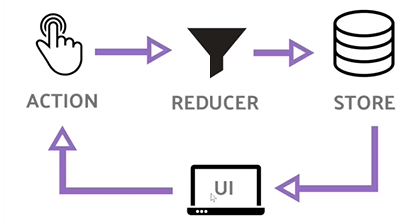

### Redux

UI (react app with ouur componenet) - For example, in our Register component, we want to put that `axios.post(..)` request in to the **action**. Then from our component, we will be able to map redux's actions using property, (`this.props.registeruser` this will be in action creators.) Once that function called, that when we make the axios request and then we get the data back from backend and maybe we want to send it to the **reducer** and save to **state**? Redux has one store. (Flux has many). _We cant mutate a state we basically create new state_.

- Component level state is only available only in that state and we cant access that from anywhere else.
- When we need application level state, Redux comes to in need.
- Helps to share data between components
- Example, in todo application, we may have one `CreateTodo` component and another `ListTodo` component. And we want to access that todo within `ListTodo` component.
- Instead of passing thing from component to component, in Redux we get single source of truth that we can dispatch to single component.
- Example, auth state, profile state, posts state, errors state etc in our application and we want to share those state with in our application.

`npm i redux react-redux redux-thunk`

**Thunk** : When we make a ajax request, we want to wait for that request, and then dispatch to our reducer. And redux thunk allows us to do that.

**Action** : Everything we do is gonna be an action. For example, when we REGISTER_USER that will be an action.
