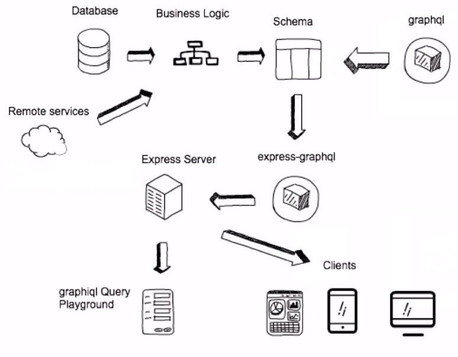

# Client Side GraphQl with Apollo

### GraphQL vs REST vs RPC vs SOAP

1. SOAP: Entires and verbs in URL
2. RPC: Remote Procedual Call, uses verbs (like a function). But need different RPC call for each operation so hard to maintain.
3. REST: nouns like `/apples` and modify using verbs like GET, PUT and POST. But everytime, while working on client we have to call or modify backend so causes delays and overheads and is no ideal for testing.
4. GraphQL: Allows to have one endpoint. Schema helps for versioning. Client can request data for the specific page and not gonna get extra data i.e. client controls the data and structure. It can also aggregate data from single calls. GraphQL is simply a protocol on top of HTTP/S and TCP/IP. It only creates POST request containing the information about the data we need. Similar to SQL, allows to modify data and still uses JOSN and can be acessed using only one url.

### Apollo

Graphql can be used with a HTTP Client like fetch, axios or superagent request and it just needs payload, url and post method. Apollo is simply an graphql client which has cacheing, formatting the query and http client build in. In other hand, _relay-modern_ has preprocessing (process query ahead of time, so extra build time). It gives better optimization. Whereas in Apollo, we have our React Component and graphql query at the buttom and we can bind those two and create a new component. And we can use that component anywhere and data will be fetched automatically with cacheing and auto UI update.

### graph.cool

It is an SaaS (BaaS to be precise) that allow us to connect to backend without our own server.

- Schema Editor
- Query Playground
- Open Source CLI Tool
- Robust DB
- Also run locally with docker container

## GraphQL Architecture

#### Typical Web Application


#### Express and Node Backend



#### Query and Schema

```graphql
<!-- Schema -->
type Product @model{
    id: ID! @isUnique
    inStoreCount: Int
    name: String! @defaultValue(value: "Default Name")
    description: String
    additionalDescription: Json
    createdAt: DateTime!
    release: DateTime
}
<!-- Query -->
query {
  allProducts {
    additionalDescription
    createdAt
    description
    inStoreCount
  }
}
<!-- Result from above query -->
{
  "data": {
    "allProducts": [
      {
        "additionalDescription": {
          "imageUrl": "https://images.unsplash.com/photo-152.png"
        },
        "createdAt": "2019-01-27T06:19:42.000Z",
        "description": "Tero Bau version 2",
        "inStoreCount": 11
      },
      {
        "additionalDescription": {
          "imageUrl": "https://i.pinimg.com/originals/c6/a2/89.jpg"
        },
        "createdAt": "2019-01-27T06:19:50.000Z",
        "description": "Tero Bau",
        "inStoreCount": 22
      }
    ]
  }

```

### Fetching data from a graphql backend

##### cURL

```bash
curl 'https://api.graph.cool/simple/v1/cjreif5524tfb0194zw60vjbu'
  -H 'Authorization: Bearer YOUR_AUTH_TOKEN'
  -d '{"query":""{allProducts{additionalDescriptioncreatedAtdescriptioninStoreCount}}""}'
```

##### Node with graphql-request

`$ npm install graphql-request`

```javascript
const GraphQLClient = require("graphql-request").GraphQLClient;

const client = new GraphQLClient(
  "https://api.graph.cool/simple/v1/cjreif5524tfb0194zw60vjbu",
  {
    headers: {
      Authorization: "Bearer YOUR_AUTH_TOKEN"
    }
  }
);

function getItem() {
  return client.request(`
    {
      allProducts {
        additionalDescription
        createdAt
        description
        inStoreCount
      }
    }
    
  `);
}
```

##### Node with fetch

`$ npm install isomorphic-fetch es6-promise`

```javascript
require("es6-promise").polyfill();
require("isomorphic-fetch");

function getItems() {
  return fetch("https://api.graph.cool/simple/v1/cjreif5524tfb0194zw60vjbu", {
    method: "post",
    headers: {
      "Content-Type": "application/json"
      //'Authorization': 'Bearer YOUR_AUTH_TOKEN'
    },
    body:
      '{"query":"{allProducts{additionalDescriptioncreatedAtdescriptioninStoreCount}}"}'
  });
}
```

##### Browser with graphql-request

```javascript
import { GraphQLClient } from "graphql-request";

const client = new GraphQLClient(
  "https://api.graph.cool/simple/v1/cjreif5524tfb0194zw60vjbu",
  {
    headers: {
      Authorization: "Bearer YOUR_AUTH_TOKEN"
    }
  }
);

function getItem() {
  return client.request(`
    {
      allProducts {
        additionalDescription
        createdAt
        description
        inStoreCount
      }
    }
    
  `);
}
```

_For Accessing Token, go to setting and then authentication and create auth there._

### GraphQL Types relationships

```graphql
type Product @model {
  ...
  orders: [Order!]! @relation(name: "OrderOnProduct")
  ...
}

<!-- Many to Many Relation -->
type Order @model {
  customerEmail: String!
  id: ID! @isUnique
  products: [Product!]! @relation(name: "OrderOnProduct")
}
```
