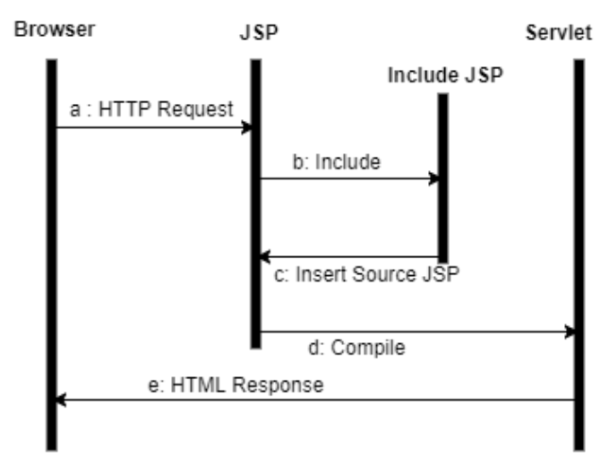
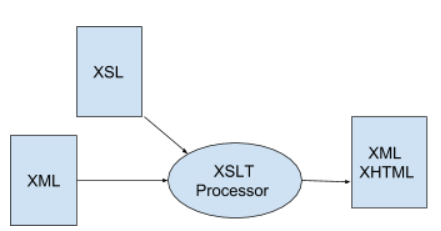
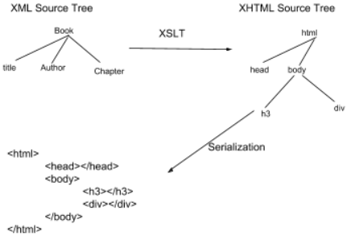
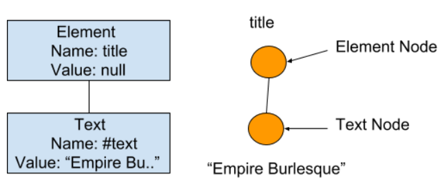
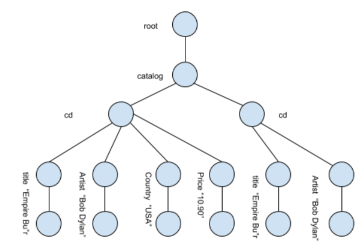
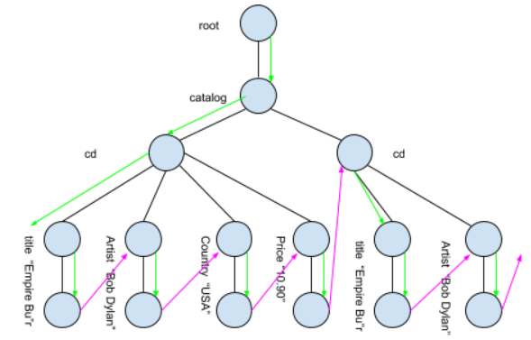

## Lecture 1 Basics

**Web Apps Vs Web Service** : Web Applications are presentation-oriented, page-based, human oriented (user interacts with page: Request/Response). Web Services are service oriented, service-based, machine oriented, Application provides “Remote Procedure Calls/Remote Methods”, Application interacts with Application (Request/Response (RPC), Message oriented).

- Website / Web Application : Human user + Web Browser Request Web Server Response (HTML, JS. GIF) Human user + Web Browser.
- Web Service: Service Consumer (Web Client) Request Service Provider (Web Server) Response (JSON, XML) Service Consumer.

**HTML Vs JSP** : HTML can only make static websites. How can we program functionality into a webpage? JSP = JavaServer Pages. Allows embedding Java code within HTML and executed by server and returned to browser as HTML. Execution Process → Web browser accesses URL of JSP page, corresponding JSP file is converted into a Java class, Java class is compiled and executed, Output is sent back to browser. In our case, server is Glassfish.

**Syntax** : `<% out.println(“Hello World”); %>` . Java Code enclosed by `<% .. %>`. Outside those tags, it is normal HTML. Examples: `<%! String name; %>` , `<%= name %>`.

## Lecture 2 HTTP Methods and JSP Basics

#### HTTP

HTTP is designed to enable client-server communication. HTTP works as a request-response protocol a client and server. The two most used HTTP methods are: GET and POST.

**GET and POST** - GET is used to Request a representation of the specific resource. Idempotent! (Only retrieval data; should not have other effects). Can be bookmarked. Appear in URL after '?' (never use GET to send sensitive data; the length is limited).On other hand, POST submits data to be processed (eg. storing, updating, ordering a product or sending Email). Non-Idempotent! Cannot be bookmarked. The data is included in the body of the request.

|                             | GET                                                                                                 | POST                                                                                                           |
| --------------------------- | --------------------------------------------------------------------------------------------------- | -------------------------------------------------------------------------------------------------------------- |
| Back button/ Reload         | Harmless                                                                                            | Data will be resubmitted                                                                                       |  |
| Cached                      | Can be cached                                                                                       | Not cached                                                                                                     |
| History                     | Parameters remain in browser history                                                                | Parameters are not saved in browser history                                                                    |
| Restrictions on data length | Yes, when sending data, the GET method adds the data to the URL; and the length of a URL is limited | No restrictions                                                                                                |
| Security                    | GET is less secure compared to POST because data sent is part of the URL                            | POST is a little safer than GET because the parameters are not stored in browser history or in web server logs |
| Visibility                  | Data is visible to everyone in the URL                                                              | Data is not displayed in the URL                                                                               |

#### JSP

Java Code is enclosed by `<% ... %>`. Outside those tags, it is normal HTML.

```jsp
<p>This is my JSP Hello World Program, So,
<%
     String firstName = request.getParameter("FIRSTNAME");
     out.println("hi "+ firstName);
%>
</p>

```

**Objects**
We can access Java objects from with JSPs. Main types of objects are Implicit Objects ( Provided by the container ) and Application-specific Objects ( Local instances, Instances of JavaBean, etc. ). Web container provides a context to provide scope of object. Some of the examples of JSP implicit objects are:

| Object      | Description                                                                                                 |
| ----------- | ----------------------------------------------------------------------------------------------------------- |
| request     | This is HttpServletRequest object associated with the request.                                              |
| response    | This is HttpServletResponse object associated with the response to the client                               |
| out         | This is the PrintWriter object used to send output to the client.                                           |
| session     | This is the HttpSession object associated with the request.                                                 |
| application | This is the ServletContext object associated with application context.                                      |
| config      | This is the ServletConfig object associated with the page.                                                  |
| pageContext | This encapsulates use of server-specific features like higher performance JspWriters.                       |
| page        | This is simply a synonym for this, and is used to call the methods defined by the translated servlet class. |
| Exception   | The Exception object allows the exception data to be accessed by designated JSP.                            |

User makes a "request" to view a page of the server. Server then executes the requested JSP and send back a "response" to the user. The server "response" contains HTML output generated by the requested JSP Page. Commonly used JSP objects are: `request` and `response`.

**Directive**
Directive are instructions to the JSP compiler (translator). Example: include includes at translation-time, NOT run-time. Two main directive are page and include.

```jsp
<%@ directiveName attribute="value" attribute= "value" %>
//Note: <%@directive %> tags.
<%@ page import="java.util.*, java.io.*"%>
<%@ include file="copyright.html"%>
```



#### Embedded Code

- **Declarations**: Declarations executed when page is initialised. It is used to define class-wide variables and methods. Declarations must produce no output.

```jsp
<%! Java variables and method declarations %>
<%! int i = 0; %>
<%! int cube = 0; %>
<%! public int cubed(int j){
      return (j*j*j);
  }  %>
```

- **Scriptlets**: Basically any Java code can go in a scriptlet.

```jsp
<%
try {
 i = Integer.parseInt(request.getParameter("mynum"));
 } catch (NumberFormatException nfe) {
out.println("Go back and enter a valid number.");
 i = 0;
 }
 cube = cubed(i);
%>
```

- **Expressions**: Expressions are primary for inserting values of Java variables into HTML code without having to type in full asa scriptlet: `<% out.print(i); %>` vs `<%= i %>`

```jsp
<%= Java expression to be evaluated %>
<body>
 <p>You entered the value <%= i %></p>
<p>That number cubed is <%= cube %></p>
 <p>I can say the same thing with <%= cubed(i) %></p>
<p>I can also use Scriptlets to get <% out.println(cube); %></p>
</body>
```

- **Standard Actions**: Actions are well-known tags that affect the runtime behaviour. Some examples are `<jsp:include .../>`,`<jsp:useBean>`, `<jsp:forward>` etc. Include directive ( JSP does not compile if there is any change in included file only (no changes in source file)) Include action (better choice for including dynamic resources).

```jsp
<jsp:include page="my.jsp" flush="true" />
```

- **Expression Language**: Expression Language (EL) introduced with JSP 2.4 & J2EE 1.4. It complements JSP Expressions with simpler syntax.

```jsp
${object}
//Each ${object} would be same as <%= object %>
```

Supports: JSP implicit objects, Java Beans, Simple Calculations, etc.

## Lecture 3 JSP Beans and Sessions

#### JSP and JavaBean

Request/Response -- JSP -- JavaBeans -- Business Processing

**Using JavaBeans** : Allows us to encapsulate reusable functionality in a “bean” . A bean is a normal Java Class that follows some rules (called Design Patterns). One basic design pattern is for “properties” which is using a getter and setter methods. JavaBeans are not a client side component model (they are not EJBS, Enterprise JavaBeans). A JavaBean is a class that conforms to the following conventions:

- Provides a public constructor with no parameter as well as with parameters(s).
- Provides a public getter and setter (to access private fields).
- Implements the `Serialization` interface. Serialization is the process of converting an object into a stream of bytes in order to store the object or transmit it to memory, a database or a file. Classes `ObjectInputStream` and `ObjectOutputStream` are high-level streams that contain the methods for serializing and de-serializing an object.

```java


package uts.wsd;

public class User implements java.io.Serializable {
   private String email;
   private String password;

   public User() { }      //Must have a default constructor
   public User(String email, String password) {
       this.email = email;
       this.password = password;
   }
//Getters
   public String getEmail(){ return email; }
   public String getPassword(){ return password; }
//Setters
   public void setEmail(String email){ this.email = email; }
   public void setPassword(String password){ this.password = password; }
 }
```

```jsp
//Using beans
<% uts.wsd.User user = new uts.wsd.User(email, name, password); %>

//OR
<%@ page import="uts.wsd.*" %>
<% User user = new User(email, name, password); %>
//Setting properties
<% user.setEmail("sharadghimire5551@gmail.com");
//Getting Properties
<%= user.getEmail() %>

```

- Using beans `<jsp:useBean id="user" class="uts.wsd.User" scope="page" />`
  - `uts.edu.User user = new uts.wsd.User()`
- Setting Properties `<jsp:setProperty name="user" property="email" value="sh@g.com"/>`
  - `user.setEmail("sh@g.com")`
- Getting Properties `<jsp:getProperty name="user" property="email" />`
  - `user.getEmail()`

**JSP Scopes**: JSP allows us to save data into a scope

| Scope       | Where saved                                                 |
| ----------- | ----------------------------------------------------------- |
| page        | Only for the current page, destroyed when we leave the page |
| request     | Kept while request is active                                |
| session     | Saved in the current session                                |
| application | Saved for the whole application                             |

**EL and JavaBeans**: Expression Language also can access JavaBeans

```jsp
//Instead of
<jsp:useBean id="user" class="uts.wsd.User" />
<jsp:getProperty name="user" properties="email" /> //this invoke user.getEmail()
//use
${user.email}
```

**Session**
Many websites use session-based interactions. HTTP is a stateless protocol so to maintain state in a web application we use Session and Cookies. A cookie is a small piece of text stored by a user's browser. Cookie stores session information on the client (a unique identifier is stored on the client side called session id). A Session is a server side storage of information that is desired throughout the user's interaction with the website. The web application pairs this session id with it's internal data and retrieves the stored variables for use by the requested page.

_JSP Session_ - A session is an implicit object associated with a visitor.

```jsp
//Data can be put in the session
Person p = new Person("John Smith");
<% session.setAttribute("theperson",p); %>

//Data can be retrieved from it
Person p = (Person) session.getAttribute("theperson");

<p> The person’s name: <%= p.getName() %> </p>
```

The content of the session will be remembered until the user closes his/her web browser or until our web application explicitly clears the session. To end an application session : `<% session.invalidate(); %>` inside logout.jsp.

**JSP Deployment**
A single JSP page is pretty simple but a complex web application is more complex and includes static HTML files, static images, JSP files, separate Java classes, CSS stylesheets etc. So, we need to package web applications for deployment.
Web applications are packaged as _WAR_ (Web Application aRchive) files. WAR files can include all of the file types plus a deployment descriptor to specify configuration settings and make the application as container-independent as possible. A WAR file can be deployed into any compliant web container or JSP/Servlet container. Apache Tomcat is a web container.

## Lecture 4 XML and JAXB

#### XML

XML documents are plain text documents, originally designed for large-scale electronic publishing (Document centric) and play an important role in storing structured data and exchange of data on the Web (Data centric). The basic rules of XML are quite simple. ⇒ Any document which obeys the rule of XML is said to be Well Formed.

- XML stands for extensible Markup Language.
- XML was designed to store and transport data.
- XML was designed to be both human and machine readable.
- XML was designed to be self-descriptive.
- XML was designed to carry data whereas HTML was designed to display data.
- XML tags are not predefined however HTML tags are defined
  A well-formed XML document obeys rules of XML
- Every XML document must have a root element
- Every start tag must have a closing tag
- No tags nested out of order
- Syntactically correct according to XML specification (eg. Markup characters (&, <, >) must be rendered by special characters: &amp, &lt, &gt

```xml


<!--type your comments here -->
<?xml version="1.0" encoding="UTF-8"?>
<!DOCTYPE addressBook SYSTEM "D:\projects\examples\xml\addressBook.dtd">
<addressBook>
      <entry list="personal">
            <name>Ms Smith</name>
            <address>1 Central Rd, Sydney</address>
            <phone>555 5555</phone>
      </entry>
      <entry list="business">
            <name>Mr Suit</name>
            <address>1 George St, Sydney</address>
            <phone>555 6666</phone>
      </entry>
</addressBook>

```

**XML Document Structure**
An XML document is a structure collection of text format markup tags. Each tag either defines some information used to describe how the document is to be interpreted or some data contained within the document. Tags in XML documents fall into the following categories:

1. Comments
2. XML Prolog
3. DTD declarations
4. Elements
5. Attributes
6. Entity references
7. Processing Instructions
8. Unparsed character data

**XML Namespace**

<!-- TODO -->

#### JAXB

Java Architecture for XML Binding (JAXB) is a software framework that allows Java developers to map Java classes to XML representations. JAXB provides two main features: the ability to marshal Java objects into XML and the inverse i.e. to unmarshal XML back into Java Objects.

```xml
<entry>
     <name>John</name>
     <phone>2232</phone>
</entry>
```

```java
// Above XML maps to :
class Entry {
     String name;
     String phone;
}
```

JAXB saves a Java object to an XML file and loads an XML file into a Java object. This makes easy to manipulate XML through normal Java approaches, is fast and supports creating and modifying XML. However, more setup work is required initially by programmer when establishing the binding.

**JAXB binding runtime**: At runtime, the generated Java classes take care of unmarshalling and marshalling XML. Marshalling (save) creating an XML document by writing out the contents of a set of Java objects. Unmarshalling (load) creating a set of Java objects by reading an XML document. JAXB provides some default binding for how to map between XML and Java. But allows us to customise the bindings too. Example:

```xml
<?xml version="1.0" encoding="UTF-8"?>
<!DOCTYPE addressBook SYSTEM "D:\projects\examples\xml\addressBook.dtd">
<addressBook>
      <entry list="personal">
            <name>Ms Smith</name>
            <address>1 Central Rd, Sydney</address>
            <phone>555 5555</phone>
      </entry>
      <entry list="business">
            <name>Mr Suit</name>
            <address>1 George St, Sydney</address>
            <phone>555 6666</phone>
      </entry>
</addressBook>

```

This XML can be represented by two classes:

```java
class AddressBook {
	private ArrayList<Entry> entries;
	// ...get/set methods...
}
class Entry {
	private String list;
	private String name;
	private String address;
	private String phone;
	// ..get/set methods ...
}
```

The ArrayList class -- Use ArrayList instead of arrays to support “resizable” arrays.

```java
ArrayList<Entry> entries = new ArrayList<Entry>();
entries.add(entry1);
entries.add(entry2);
// ....
```

**JAXB Annotations**
The mapping between Java and XML is specified with Java annotations:

- `@XmlAccessorType(XmlAccessType.FIELD)` - By default, map all Java fields to XML elements
- `@XmlRootElement(name=”addressBook”)` - Map a Java class to the root XML element
- `@XmlElement(name=”entry”)` - Map a field to an XML element
- `@XmlElementWrapper(name=”addressBook”)` - Add a wrapper element around a list of elements
- `@XmlAttribute(name=”list”)` - Map a field to an XML attribute

Sample

```java

@XmlAccessorType(XmlAccessorType.FIELD)
@XmlRootElement(name = "entry")
class Entry {
      @XmlAttribute(name="list")
	private String list;
      @XmlElement(name="name")
	private String name;
      @XmlElement(name="address")
	private String address;
      @XmlElement(name="phone")
	private String phone;
	..get/set methods ...
}
// --------------------------

@XmlAccessorType(XmlAccessorType.FIELD)
@XmlRootElement(name="addressBook")
class AddressBook {
 	@XmlElement(name="entry")
	private ArrayList<Entry> entries;
	...get/set methods...
}

```

**JAXB code - Unmarshall**

```java

JAXBContext jc = JAXBContext.newInstance(AddressBook.class); //The type of class I am going to be marshalling
Unmarshaller u = jc.createUnmarshaller();
AddressBook abook = (AddressBook) u.unmarshal(new FileInputStream("abook.xml"); //Will give Object so typecasting
//abook has a ArrayList which will allow to store each entries

//Now we have a JavaBean with address elements...
ArrayList<Entry> al = abook.getEntries();
for(Entry entry : al) {
	System.out.println(entry.getName());
}

```

**JAXB code - Marshall**

```java
JAXBContext jc  = JAXBContext.newInstance(AddressBook.class);
Marshaller m = jc.createMarshaller();
//Make the generated XML look nice
m.setProperty(Marshaller.JAXB_FORMATTED_OUTPUT, true); //Enable the marshaller formatting : text, xml etc.
m.marshal(addressBook, new FileOutputStream("abook.xml"); //addressBook is pre-existing object
//The object is now written to abook.xml
```

## Lecture 5 XML Schema

#### DTD and XML Schema

Often we need to add rules to structure an XML document. Want to define allowed tags, elements, attributes and their order and data types. Use Document Type Definitions (DTD) or an XML Schema. This allows validation of XML documents to check its conformity to the grammar expressed by the schema.
Well formed → XML document follows the basis syntax rules of XML. Valid → Schema valid → XML document follows the basic syntax rules of XML and also follows the rules in its associated DTD or XML Schema.
XML Schema vs DTD → XML Schema utilize an XML-based syntax, whereas DTDs have a unique syntax. Roughly, DTDs are old-style XML Schema, and are still used but becoming less common. XML Schema allows a language designer to express more constraints than DTDs allow, e.g. DTD does not have support for data types (everything is text), data types associated with CDATA (xs:string, xs:integer etc.), user-defined data types. Etc.

```
<!-- DTD -->
<!ELEMENT item (shirt)>
<!ELEMENT shirt (#PCDATA)>
<!ATTLIST shirt size_value (small | medium | large)>

<!-- XML Schema: Create a ‘simpleType’ called size-values -->
<xs:element name="size" type="size_value">
```

DTD Example:

```
<?xml version="1.0"?>
<!DOCTYPE web-app PUBLIC "-//UTS//note DTD1.0//EN" "http://learn.it.uts.edu.au/wsd/fax1_0.dtd">
<fax>
<to>Min</to>
<from>Wayne</from>
<faxnumber>9514-9999</faxnumber>
<heading>31284 WSD</heading>
<body>Give everyone HD</body>
</fax>

We can also use <!DOCTYPE note SYSTEM "note.dtd"> for external DTD files
<!-fax1_0.dtd file -->
<!ELEMENT fax (to, from, faxnumber, heading?, body?)>
  <!ELEMENT to (#PCDATA) #REQUIRED>
  <!ELEMENT from (#PCDATA) #REQUIRED>
  <!ELEMENT faxnumber (#PCDATA) #REQUIRED>
  <!ELEMENT heading (#PCDATA)>
  <!ELEMENT body (#PCDATA)>

```

- XML Schema defines a sub-language of XML i.e Like a DTD, adds more control over the syntax of our XML document.
- Often represented as a separate XML document itself (usually with an extension of .xsd)
- XML Schema describes the structure of an XML document. The XML Schema language is also referred to as XML Schema Definition (XSD).
- The purpose of an XML Schema is to define the legal building blocks of an XML document:
  - The elements and attributes that can appear in a document.
  - The number of (and order of) child elements.
  - Data types for elements and attributes
  - Default and fixed values for elements and attributes
- XML Schema support Data Types. It is easier to validate the correctness of data, to define restriction on data, to define data patterns (data formats) and to convert data between different data types.
- XML Schema have predefined data types eg. string, boolean, integer, positiveInteger, time, date, dateTime, negativeInteger, duration, base64Binary, hexbinary, Name, decimal, QName, anyURI, ID, IDREF etc
- The schema definition itself allows the structure of elements and attributes to be defined, along with any constraints on these elements and attributes.
- An element definition looks like
  `<element name=”elementName” type=”elementType” minOccurs=”min times allowed to occur” maxOccurs=”max times allowed to occur” />`
- The XML schema specification defines some standardard elementTypes. We can also define our own element types.
- A complex type definition is of the following form

  ```xml
  <complexType name="typeName">
     <[element definition]>
     <[element definition]>
  </compleType>
  ```

- An attribute definition is of following form:
  `<attribute name="attributeName" type="attributeType" [attributes options]>`

**Structure**

1. `<?xml version="1.0"?>` : describes the xml version used
2. `<xsd:schema> .... </xsd:schema>` : is the root element of every XML Schema
3. `xmlns:xsd=http://www.w3.org/2001/XMLSchema` : indicates that the elements and data types used in the schema come from the above namespace. It also specifies that the elements and data types that come from the above namespace should have prefix xsd.
4. `targetNamespace=http://learn.it.uts.edu.au/wsd` : indicates that the elements defined by this schema (to, from, faxnumber, heading, body) come from the "http://learn.it.uts.edu.au/wsd" namespace.
5. `xmlns=http://learn.it.uts.edu.au/wsd` : indicates that the default namespace is "http://learn.it.uts.edu.au/wsd“
6. `elementFormDefault="qualified"` : indicates that any elements used by the XML instance document which were declared in this schema must be namespace qualified.
7. `<xsd:element name="from" type="xsd:string"/>` : This is the syntax for defining a simple element named “from” of data type “string”
8. `<xsd:element name="from" type="xsd:string" default="Ryan"/>`: A default value is automatically assigned to the element when no other value is specified. In this example default value is “Ryan”
9. `<xsd:element name="from" type="xsd:string" fixed="Ryan"/>`: A fixed value is also automatically assigned to the element, and you cannot specify another value (constant value)
10. `<xsd:attribute name="from" type="xsd:string"/>`: This is the syntax for defining an attribute named “from” of data type “string”
11.

```xml
<xsd:simpleType name="telnoType">
   <xsd:restriction base="xsd:string">
      <xsd:pattern value="[0-9]{4}-[0-9]{4}"/>
   </xsd:restriction>
</xsd:simpleType>
```

This is a sample syntax for defining custom data-type → With name “telnoType” → With restriction of base “string” type → With pattern value using regular expression “[0-9]{4}-[0-9]{4}” which allows 4 digits exactly between 0 and 9 each. Followed by “-” then followed by 4 digits exactly between 0 and 9 each.

12. Defining a complex element by directly naming its simple elements in a sequence

````xml
<xsd:element name="fax">
  <xsd:complexType>
     <xsd:sequence>
       <xsd:element name="from" type="xsd:string"/>
       <xsd:element name="to" type="xsd:string"/>
       <xsd:element name="faxnumber" type="xsd:string"/>
       <xsd:element name="heading" type="xsd:string"/>
       <xsd:element name="body" type="xsd:string"/>
    </xsd:sequence>
  </xsd:complexType>
</xsd:element>
```
13. Defining a complex element using custom data-type user defined:

```xml
<xsd:simpleType name="telnoType">
  <xsd:restriction base="xsd:string">
     <xsd:pattern value="[0-9]{4}-[0-9]{4}"/>
  </xsd:restriction>
</xsd:simpleType>
```
We can add more custom types here for the other elements

```xml
<xsd:element name="fax">
  <xsd:complexType>
    <xsd:sequence>
      <xsd:element name="from" type="xsd:string"/>
      <xsd:element name="to" type="xsd:string"/>
      <xsd:element name="faxnumber" type="telnoType"/>
      <xsd:element name="heading" type="xsd:string"/>
      <xsd:element name="body" type="xsd:string"/>
    </xsd:sequence>
  </xsd:complexType>
</xsd:element>
````

**Sample XML Schema**

```xml

<?xml version="1.0"?>
<xsd:schema xmlns:xsd="http://www.w3.org/2001/XMLSchema"
      targetNamespace="http://learn.it.uts.edu.au/wsd"
      xmlns="http://learn.it.uts.edu.au/wsd"
      elementFormDefault="qualified">
  <xsd:element name="fax">
    <xsd:complexType>
      <xsd:sequence>
        <xsd:element name="from" type="xsd:string"/>
        <xsd:element name="to" type="xsd:string"/>
        <xsd:element name="faxnumber" type="xsd:string"/>
        <xsd:element name="heading" type="xsd:string"/>
        <xsd:element name="body" type="xsd:string"/>
     </xsd:sequence>
   </xsd:complexType>
 </xsd:element>
</xsd:schema>

```

**Using Custom Data Type**

```xml
<?xml version="1.0"?>
<xsd:schema xmlns:xsd=http://www.w3.org/2001/XMLSchema targetNamespace="http://learn.it.uts.edu.au/wsd" xmlns=http://learn.it.uts.edu.au/wsd elementFormDefault="qualified">
<xsd:simpleType name="nameType">
  <xsd:restriction base="xsd:string">
    <xsd:pattern value="[A-Z][a-z]*"/>
  </xsd:restriction>
</xsd:simpleType>
<xsd:simpleType name="telnoType">
  <xsd:restriction base="xsd:string">
    <xsd:pattern value="[0-9]{4}-[0-9]{4}"/>
  </xsd:restriction>
</xsd:simpleType>
 <xsd:element name="fax">
  <xsd:complexType>
    <xsd:sequence>
       <xsd:element name="from" type="xsd:string"/>
       <xsd:element name="to" type="xsd:string"/>
       <xsd:element name="faxnumber" type="xsd:string"/>
       <xsd:element name="heading" type="xsd:string"/>
       <xsd:element name="body" type="xsd:string"/>
    </xsd:sequence>
  </xsd:complexType>
 </xsd:element>
</xsd:schema>

```

**Regular Expression**
Most string pattern matching in file managers is based on regular expressions, like -“\*.txt” means all files ending with .txt (in file management). Regular expression syntax:

- string matches the exact string “string”
- [ABC] matches A or B or C only
- [A-Z] matches A, B … to Z
- . matches any characters
- - means zero or more of the preceding patterns
- {2} means exactly 2 of the preceding pattern
- Examples: [a-z]{3} → abc, evr, etc. a\* → a, aa, aaaa etc. .+ → e, vv etc.
- "+" means to repeat the preceding pattern one or more times
- "\*" means to repeat the preceding pattern zero or more times
- You can also specify how many times to repeat using curly braces, e.g. {2} means repeat twice, {2,4} means repeat either 2 or 3 or 4 times.
- You can use square brackets to create a set of characters, where any one of them is allowed, e.g. [A-Z] permits any single character from ABCDEFGHIJKLMNOPQRSTUVWXYZ. While technically you could also write [ABCDEFGHIJKLMNOPQRSTUVWXYZ] instead of [A-Z], if you did that in your answer you would have been marked incorrectly because you were asked for the simplest regex.
- Similarly, you can represent any single digit by using [0-9]. But you can also represent a digit with the shorthand character class \d. So writing \d will also match any single character from 0123456789.
- You can use parentheses (round brackets) for grouping together several items - but in this regex you didn't need to do that
- Regular expressions are case sensitive. So [A-Z] is different from [a-z]
- .\* start with any single character repeated zero or more times
- \. followed by an actual dot (period character)

## Lecture 6 XSLT

#### XSL Transformation

Often we need to transform XML to different formats examples: from one Schema to another or from XML to XHTML, or form XML to text. Use Extensible Stylesheet Language Transformations (XSLT). This also requires using XPath expressions to match elements and attributes.

**XSLT Formatting**



**XSLT Tree Conversion** : XSLT converts a source tree into a result tree.



**XSL Structure**

```xml

<?xml version="1.0"encoding="UTF-8"?>
<xsl:stylesheet version="1.0" xmlns:xsl="http://www.w3.org/1999/XSL/Transform">
   <xsl:template match="...">

   </xsl:template>

   <xsl:template match="...">
   </xsl:template>
   ...
   <xsl:template match="...">
   </xsl:template>
</xsl:stylesheet>

```

**Modelling XML Documents** :`<title> Empire Burlesque </title>`



**XML Document Tree**



**Tree Walking**

- If the current node has children, then the first child is chosen → (green arrow)
- If the current node has following siblings, then the next sibling is chosen → (orange arrow)
- If the current node does not have a following sibling, then the following sibling with following siblings is chosen → (red arrow)
- If no such ancestors exist, then process is complete
- Also called a _“preorder traversal”_ of a tree



**XSL Template**

```xml
<?xml version="1.0"?>
<xsl:stylesheet version="1.0" xmlns:xsl="http://www.w3.org/1999/XSL/Transform">
    <xsl:template match="/"> <!-- The "root" element -->
      Some Output
    </xsl:template>
</xsl:stylesheet>
```

**XSL Text Output**

```xml
<?xml version="1.0"?>

<xsl:stylesheet version="1.0" xmlns:xsl="http://www.w3.org/1999/XSL/Transform">
<xsl:template match="/"> <!-- The "root" element -->
<html> Contents </html>
</xsl:template>
</xsl:stylesheet>
```

**Invoking another template**

```xml
<?xml version="1.0"?>

<xsl:stylesheet version="1.0" xmlns:xsl="http://www.w3.org/1999/XSL/Transform">
<xsl:template match="/"> <!-- The "root" element -->

<html> Contents
<h1>. . . </h1>
<xsl:apply-templates />
</html>
</xsl:template>
<xsl:template match="cd">
<tr>
<xsl:apply-templates/>
</tr>
<xsl:template>
<xsl:template match="title">
<tr>
<xsl:apply-templates/>
</tr>
<xsl:template>
<xsl:template match="artist">
<tr>
<xsl:apply-templates/>
</tr>
<xsl:template>
<xsl:template match="country">
<xsl:template match="country">
<xsl:template match="country">

</xsl:stylesheet>
```

#### XPath

<!-- TODO -->

#### XML Document-centric and Data Centric

<!-- TODO -->

#### Lecture Demo

```xml
<?xml version="1.0" encoding="UTF-8"?>
<?xml-stylesheet type="text/xsl" href="xsl/books.xsl"?>
<!-- Books.xml -->
<books>
  <book>
    <title>The Lord of the Rings</title>
    <genre>Epic</genre>
    <number>3556</number>
    <rating>10</rating>
    <status>available</status>
  </book>
  <book>
    <title>The Godfather</title>
    <genre>Drama</genre>
    <number>4881</number>
    <rating>9</rating>
    <status>available</status>
  </book>
  <books>

<!-- Books.xsl -->
<?xml version="1.0" encoding="UTF-8"?>
<xsl:stylesheet xmlns:xsl="http://www.w3.org/1999/XSL/Transform" version="1.0">
  <xsl:output method="html"/>
  <xsl:template match="/"> Start from the XML root element
    <html><head></head><body>
        <xsl:apply-templates/>  This is the main XSL tag that executes all tags below
                                    within the HTML body-tags.
    </body></html>
  </xsl:template>
  <xsl:template match="books"> Finds XML books tag and transform books list
    <table>
      <thead>
        <tr>
          <th>Title</th>
          <th>Genre</th>
          <th>Number</th>
          <th>Rating</th>
          <th>Rating</th>
        </tr>
      </thead>
      <tbody>
        <xsl:apply-templates/> This XSL template is executed next to transform each book
                                  to table row
      </tbody>
    </table>
  </xsl:template>
  <xsl:template match="book"> Finds each book and transforms each node to a table cell
                                which holds the node-text
    <tr>
      <td>
        <xsl:value-of select="title"/>
      </td>
      <td>
        <xsl:value-of select="genre"/>
      </td>
      <td>
        <xsl:value-of select="number"/>
      </td>
      <td>
        <div style="width: 200px; height: 12px; background: #42f453;">
          <div style="width: {20 * rating}px; height: 12px; background: #42aaf4;"/>
        </div>
      </td>
      <td>
        <xsl:value-of select="status"/>
      </td>
    </tr>
  </xsl:template>
</xsl:stylesheet>
```

**Books.jsp**

```jsp
//Transform Document-Centric XML using JSTL
<%@ taglib prefix="c" uri="http://java.sun.com/jsp/jstl/core" %> Include JSTL core
                                                                 library
<%@ taglibprefix="x" uri="http://java.sun.com/jsp/jstl/xml" %> Include JSTL formatting
                                                                 library
<html>
  <head>
    <title>Library JSP</title>
  </head>
<body>
    <c:import url=" /yourfile location/books.xml" var="inputDoc" />
    <c:import url="/yourfile location/books.xsl" var="stylesheet" />
    <x:transform xml= "${inputDoc}" xslt= "${stylesheet}" />
</body>
</html>
```

**Transform Data-centric XML using JSTL**

```jsp
<%@ taglib prefix="c" uri="http://java.sun.com/jsp/jstl/core" %>
<%@ taglib prefix="x" uri="http://java.sun.com/jsp/jstl/xml" %>

(.....Java Code to generated books data goes here ...)

<c:set var= "xmltext">
  <books>
    <%  for (Book book: matches) {   %>
      <book>
        <title> <%= book.getTitle()%></title>
        <genre> <%= book.getGenre()%> </genre>
        <number> <%= book.getNumber()%> </number>
        <rating> <%= book.getRating()%> </rating>
        <status> <%= book.getStatus()%> </status>
      </book>
    <%}%>
  </books>
</c:set>
<c:import url="/your file location/books.xsl" var="stylesheet" />
<x:transform xml= "${xmltext}" xslt= "${stylesheet}" />
```

**Transform Data-Centric XML using XSL in JSP**

```jsp
<%@page contentType="application/xml"%>
<?xml version="1.0" encoding="UTF-8"?>
<?xml-stylesheet type="text/xsl" href="xsl/books.xsl"?>

 (.....Java Code to generated books data goes here ...)

<books>
 <%  for (Book book: matches) {   %>
   <book>
     <title><%= book.getTitle()%></title>
     <genre><%= book.getGenre()%></genre>
     <number><%= book.getNumber()%></number>
     <rating><%= book.getRating()%></rating>
     <status><%= book.getStatus()%></status>
   </book>
 <%}%>
</books>
```

**Transform Data-Centric XML using Java Transformer Factory**

```jsp
<%@page import="uts.library.*" import="java.util.*" %>
<%@page import="uts.controller.XMLGenerator"%>
<%Books books= booksApp.getBooks();%>
<%
  XMLGeneratorgenerator = new XMLGenerator();
  String genre = request.getParameter("genre");
  String title = request.getParameter("title");
  String status = request.getParameter("status");
  ArrayList<Book> matches = books.getMatches(genre);
  Books matchingBooks= newBooks();
  matchingBooks.addAll(matches);
  generator.renderHTML(matchingBooks, out);
%>
```
